# Handoff 002 — review and evidence

Repository: [Patchagray/LifeIsLearned](https://github.com/Patchagray/LifeIsLearned) · Branch: `feature/handoff-002-ui-polish`

Tested source: [`12ec69ad440384531e2ee9bad7c3b65a8ed0ea0a`](https://github.com/Patchagray/LifeIsLearned/commit/12ec69ad440384531e2ee9bad7c3b65a8ed0ea0a). Later evidence/documentation commits do not alter the tested implementation. [Machine-readable verification](verification.json) records exact commands, destinations, results, timings, and source/image SHA-256 hashes. [Validation details and physical-device acceptance](../../VALIDATION.md).

## Physical-device acceptance

On October 4, 2026, commit `f4a8693645c3e97a54567f1034f4d463b6506fb3` built, installed, and launched on an iPhone 15 Pro Max running iOS 27.2. After performing the physical checks, the user reported **“All checks are good”** and approved pushing the work. [Device verification](DEVICE_VERIFICATION.md) records the deployment evidence and distinguishes it from the user's overall acceptance report. The images below remain simulator captures.

## Before and after

These are real SwiftUI views rendered in the iPhone simulator. Baseline app source is `7913c1d9af31ee457decf0a0efc8e6790cc43174`. The baseline used a temporary screenshot harness. Final hosted screenshots use the committed `PresentationTests` harness; they inject deterministic lesson state and do not audition narration.

| Screen | Before | After |
| --- | --- | --- |
| Home | 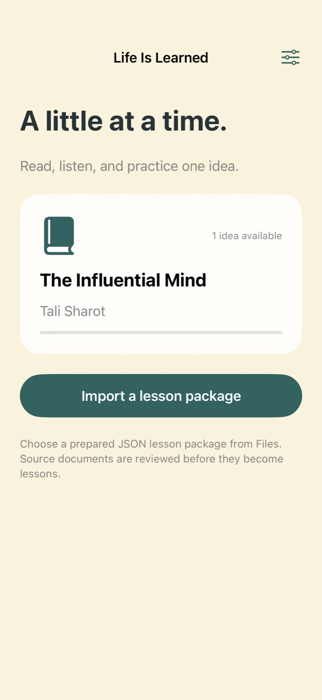 | 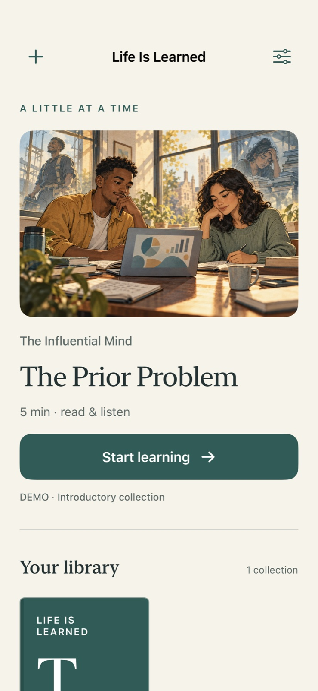 |
| Book | 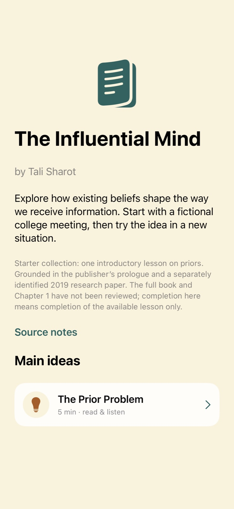 | 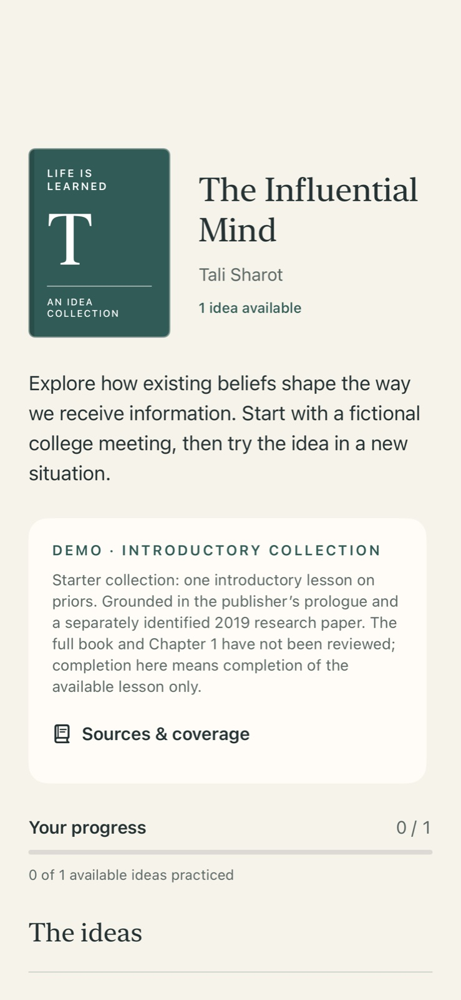 |
| Reader | 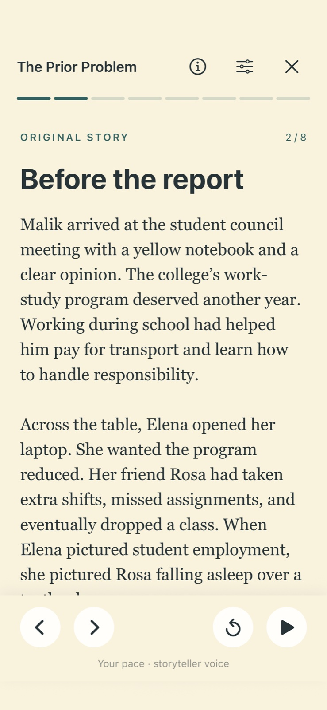 | 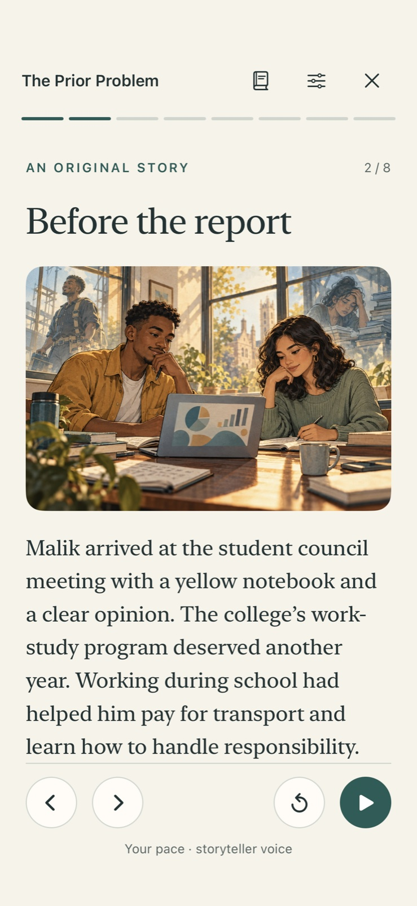 |

## A complete journey

| Import review | Takeaway | Incorrect-answer feedback |
| --- | --- | --- |
| 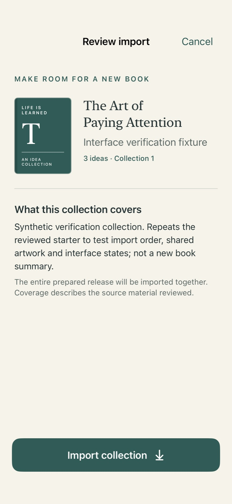 | 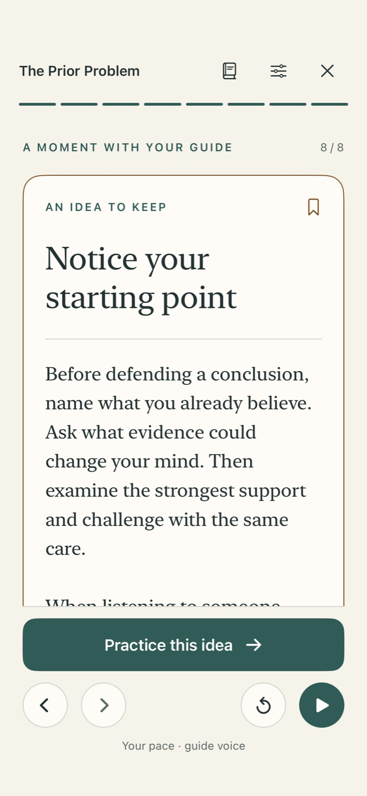 | 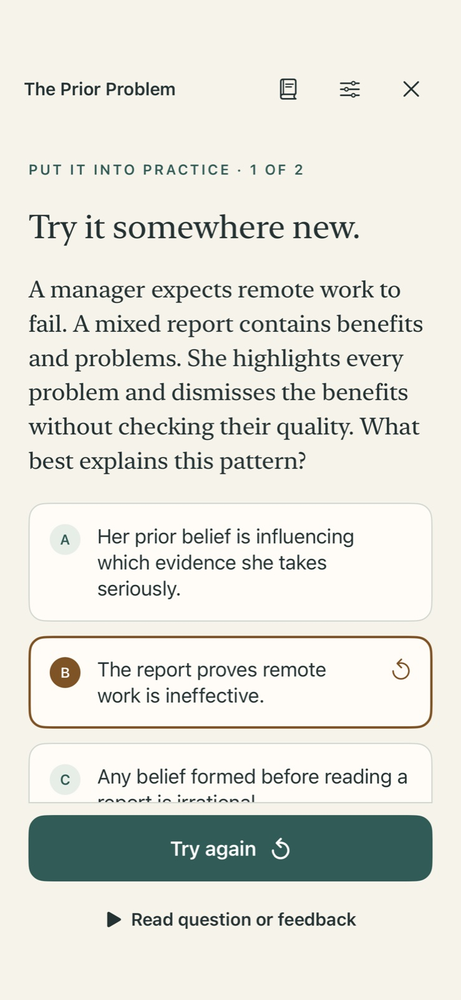 |

| Correct answer | Completion | Voice and pacing settings |
| --- | --- | --- |
| 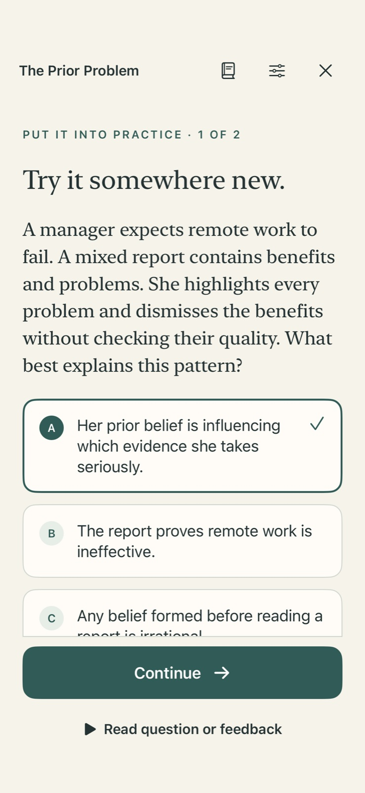 | 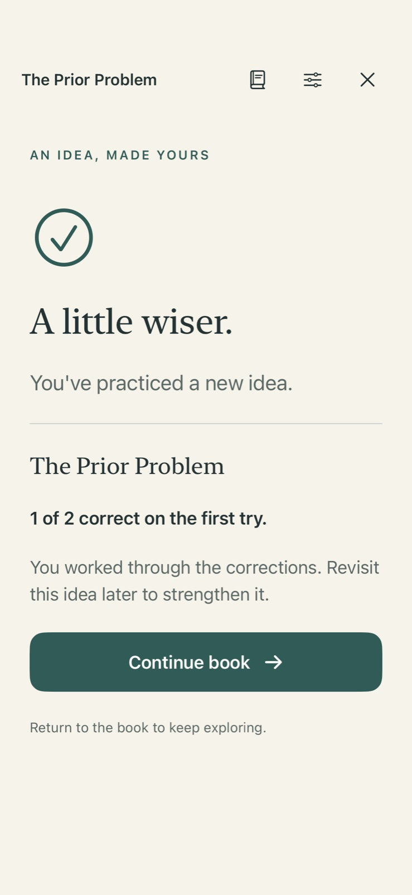 | 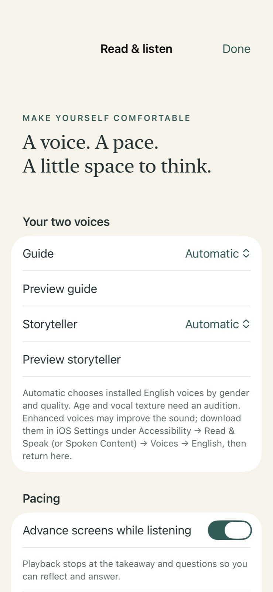 |

[Collection update preview](iphone-import-update.jpg) · [Sources and coverage](iphone-sources.jpg)

The additional collection and long titles are clearly labeled synthetic interface fixtures made by repeating the reviewed starter. They are verification content, not additional book summaries. Covers are designed placeholders, not publisher artwork.

## Real app interaction

`LearningJourneyUITests` launches the actual app with isolated test storage, opens the book and lesson, uses Back/Next, rotates, reveals the takeaway, chooses an incorrect answer, terminates and relaunches, resumes feedback without audio, retries, completes the second question, checks the first-attempt score, and returns to the book's practiced idea list.

| Reading | Restored/retry path | Completion |
| --- | --- | --- |
| 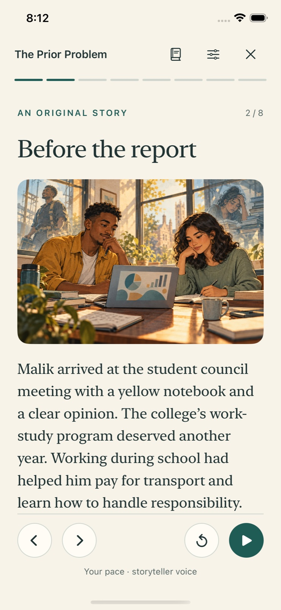 | 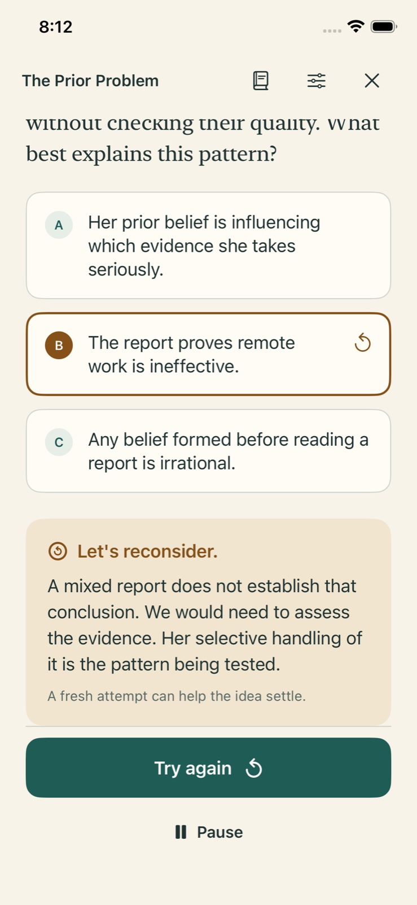 | 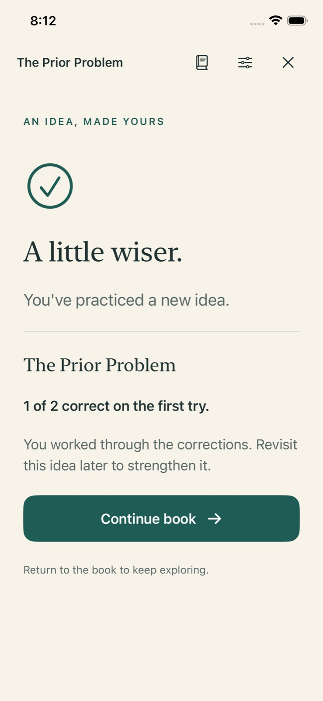 |

[Actual iPhone simulator in landscape](iphone-live-reader-landscape.jpg) · [Actual iPad simulator in landscape](ipad-live-reader-landscape.jpg)

These images use the [XCTest full-screen capture API](https://developer.apple.com/documentation/xcuiautomation/xcuiscreen). The UI test verifies orientation before capture. Reading screens are manually navigated in this UI test; automatic speech transitions are verified separately using the controllable narrator. The user's subsequent hardware acceptance is recorded separately above.

## Adaptive and accessible layouts

| iPad home | iPad reading | Dark feedback |
| --- | --- | --- |
| 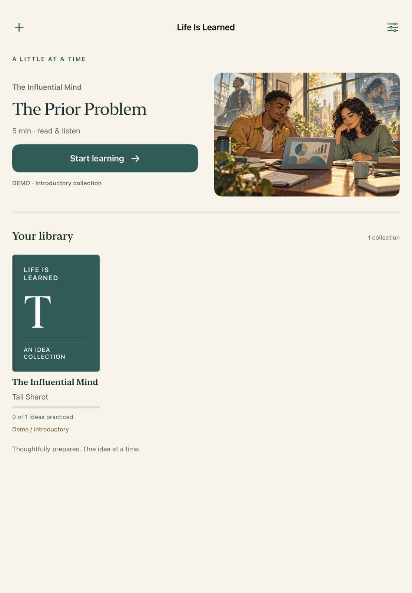 | 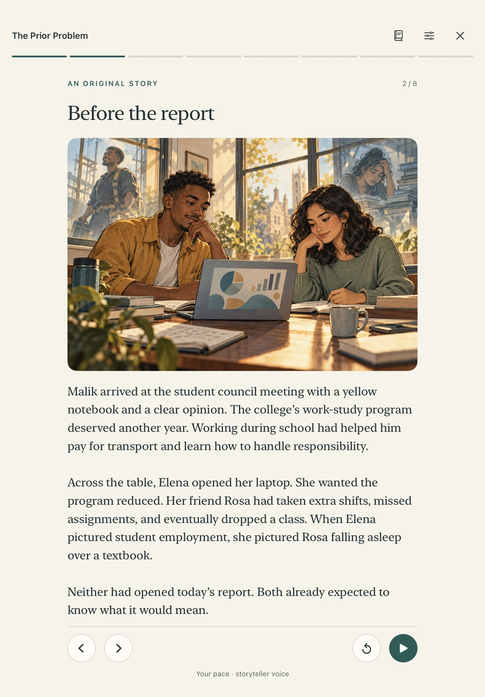 | 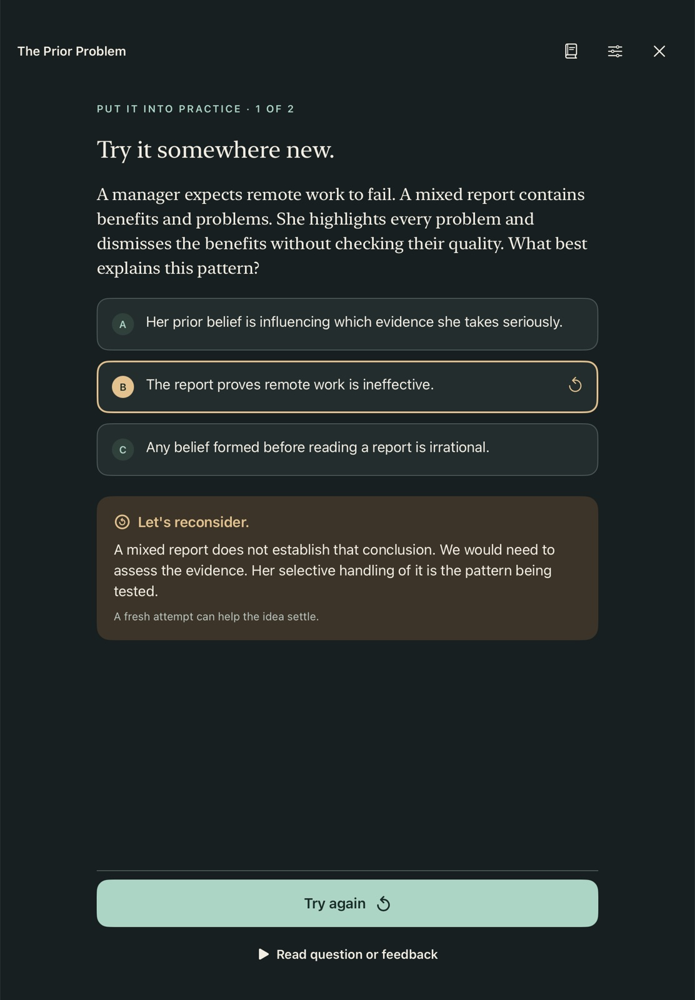 |

Additional inspected states:

- [Two-book phone library](iphone-home-multiple-books.jpg), [two-book iPad library](ipad-home-multiple-books.jpg), [no results](iphone-search-empty.jpg), and [empty 320-point library](iphone-empty-library-narrow.jpg).
- [Long title with large text](iphone-book-long-title.jpg), [large reader text](iphone-reader-large-text.jpg), [large-text phone library](iphone-library-large-text.jpg), and [large-text iPad library](ipad-library-large-text.jpg).
- [Dark reader](iphone-reader-dark.jpg), [dark takeaway](ipad-takeaway-dark.jpg), [dark settings](ipad-settings-dark.jpg), and [dark import](ipad-import-preview-dark.jpg).
- [iPad book](ipad-book.jpg) and [landscape-sized hosted reader](ipad-reader-landscape.jpg).

All hosted captures use actual simulator rendering. Window sizes are controlled by the tests: normal phone 390 × 844 points, tablet 820 × 1180, swapped dimensions for hosted landscape, and 320 × 568 for empty/narrow. Large text uses accessibility categories 1 or 3. The live app screenshots include the device's actual safe areas and rotation.

The review corrected cover stretching, long-title clipping, highlight-induced text reflow, completion navigation, navigation-bar transparency while scrolling, and accessible grid width bounds. Text/primary-action contrast pairs meet the tests' 4.5:1 threshold in both appearances. Screenshots do not constitute a VoiceOver or real-audio interruption test.

## Reproduce and inspect

Open `LifeIsLearned.xcodeproj`, select **LifeIsLearned → iPhone 16e** (or **iPad (A16)**), then **⌘U**. Use **⌘R** to explore normally. The shared scheme includes unit/layout and UI tests. Exact CLI commands are in `verification.json`.

The two final simulator runs include 28 unit/layout tests and one app journey each. Portable validation separately checks bundled/example files, project membership, and synthetic multi-idea packages. The maximum-count native fixture imports and reloads 100 ideas × 40 pages with 32 shared images. The JSON includes elapsed Debug-test times and a main-actor heartbeat during import; those timings are not a device performance promise.

Published images are JPEG copies (quality 85, maximum 1600-pixel edge) of original simulator captures. No screen layout was retouched. Raw logs and original result bundles are kept on the Mac under `~/Library/Logs/LifeIsLearned/Handoff002/`; build products and intermediate runs remain in `/tmp/LifeIsLearned-*`. No secrets, personal app progress, DerivedData, or `.xcresult` bundles are published.
